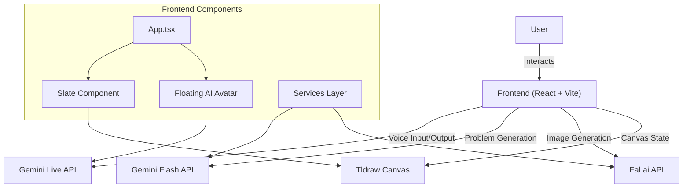

# VEDA AI

VEDA AI is an interactive learning tool where an AI tutor assists users in solving problems through conversation and on-the-fly image generation. The app uses Gemini Live for real-time voice interaction and Nano Banana for creating visual aids.

## Features

- **Real-time AI Tutor**: Interact with VEDA AI using voice commands via Gemini Live.
- **Visual Learning**: Generates watercolor-style illustrations to explain concepts using Fal.ai.
- **Interactive Canvas**: Solve problems on a shared canvas with the AI.
- **Multi-Subject Support**: Covers Algorithms, Mathematics, Physics, Chemistry, and more.
- **Progress Tracking**: Keep track of your learning journey.

## Architecture

The application is built using a modern frontend stack integrated with powerful AI services.



### Core Components

1.  **Frontend (React + Vite)**: The main application framework providing a fast and responsive user interface.
2.  **Gemini Live API**: Powers the real-time voice interaction, allowing the AI to understand and respond to spoken user queries instantly.
3.  **Gemini Flash API**: Used for generating educational problems, validating answers, and providing text-based guidance.
4.  **Fal.ai API**: Generates high-quality, watercolor-style images on the fly to visually explain complex concepts.
5.  **Tldraw**: A collaborative canvas engine that allows users to draw, write code, and interact with the AI visually.

## Tech Stack

- **Frontend**: React, Vite, Tailwind CSS
- **AI Integration**: Google GenAI (Gemini), Fal.ai
- **Canvas**: Tldraw
- **Language**: TypeScript

## Getting Started

### Prerequisites

- Node.js (v18 or higher)
- npm or yarn
- API Keys for:
    - [Google Gemini API](https://aistudio.google.com/)
    - [Fal.ai API](https://fal.ai/)

### Installation

1.  Clone the repository.
2.  Install dependencies:
    ```bash
    npm install
    ```

### Environment Setup

1.  Create a `.env` file in the root directory of the project.
2.  Add your API keys to the file:

    ```env
    GEMINI_API_KEY=your_google_gemini_api_key
    FAL_API_KEY=your_fal_ai_api_key
    ```

    > **Note**: Ensure you do not commit your `.env` file to version control.

### Running the Application

Run the development server:
```bash
npm run dev
```

The application will be available at `http://localhost:3000` (or the port shown in your terminal).

## License

Apache-2.0
